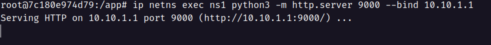
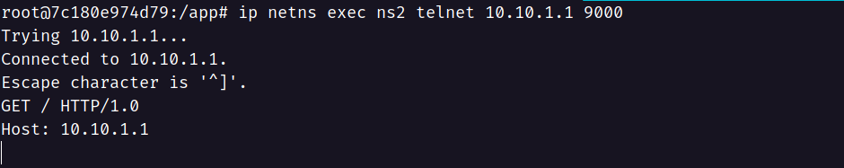
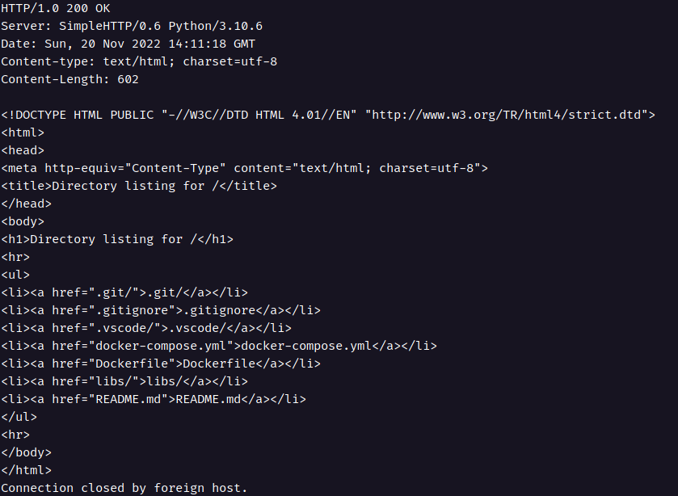
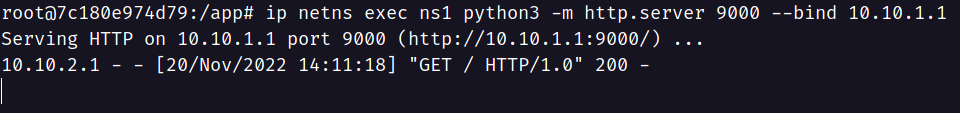
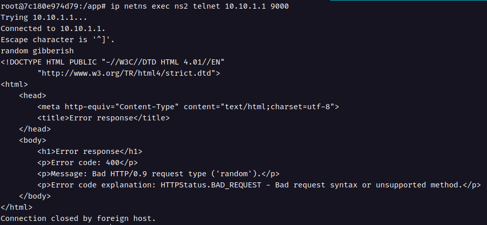
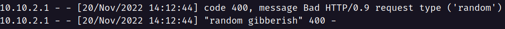

### Connect to a `python HTTP Server` on Separate Namespace

To understand the Linux network namespaces a bit better, we'll try to spin up an HTTP server using python in one namespace and connect with it using another namespace.

We'll start by creating two namespaces and connecting them using a virtual ethernet (veth). The [previous tutorial](https://dev.to/umarfchy/connecting-linux-network-namespaces-with-veth-4cfk) covers this in a step-by-step process. This tutorial is a part of [personal project](https://github.com/umarfchy/playing-with-linux-network-namespaces) where we can find a `docker-compose` file that spins up the environment with a single command `docker compose up -d`. This will start a docker container named `network-companion`. We can enter into the container using `docker exec -it network-companion bash` from the terminal (let's call it `terminal 1`). There we'll find `prepare_env.sh` script inside the `libs/connect_to_python_server/` directory. The script can be used to generate and connect the namespaces quickly. This essentially automates the process entailed [here](https://dev.to/umarfchy/connecting-linux-network-namespaces-with-veth-4cfk). Once we run the script, we'll have two namespaces with the following specifications -

| Namespace | veth Interface | Gateway IP |
| :-------: | :------------: | :--------: |
|    ns1    |      n1e       | 10.10.1.1  |
|    ns2    |      n2e       | 10.10.2.1  |

<h3 align="center"> Table 1 - Specifications of Created Network Namespaces</h3>

Now, we'll spin up the python server on `ns1` namespace and bind the gateway IP with the server using 👉 `python -m http.server <PORT> --bind <GATEWAY_IP>` in the current terminal (let's call it `terminal 1`). As the gateway IP for `n1e` is `10.10.1.1` we'll use the command 👇 to spin up the server

```bash
ip netns exec "ns1" python3 -m http.server 9000 --bind 10.10.1.1
```

<figure>
<figcaption align = "center">Fig.1 - Starting the python server</figcaption></figure>

Now, let's open up another terminal and access the docker env `docker run exec -it network-companion bash`. Now, connect to the python server using `telnet` as follows

```bash
ip netns exec "ns2" telnet 10.10.1.1 9000
```

<figure>
<figcaption align = "center">Fig.2 - Making request using telnet</figcaption></figure>

If we can see similar to Fig.2 in our terminal then we're connected to the server.

Now, let's make an HTTP request to the python server by typing the following to the cli -

```bash
GET / HTTP/1.0
Host: 10.10.1.1
```

<figure>
<figcaption align = "center">Fig.3 - Requesting using HTTP protocol</figcaption></figure>

Once we request by pressing the enter key, we can see that the server responds with HTML which essentially lists out the contents in the directory -

<figure>
<figcaption align = "center">Fig.4 - Response on HTTP request</figcaption></figure>

We can also see the logs of the python server on `terminal 1` -

<figure>
<figcaption align = "center">Fig.5 - Logs of Python Server (1) </figcaption></figure>

Let's create the telnet connection again and make a request to the python server that does not comply with the HTTP protocol. This will result in an error response with HTML as follows -

<figure>
<figcaption align = "center">Fig.6 - Error response on improper request</figcaption></figure>

We can again check the logs in `terminal 1` -

<figure>
<figcaption align = "center">Fig.7 - Logs of Python Server (2) </figcaption></figure>

This marks the end of our experiment! Keep exploring the network namespaces and thanks for reading.
